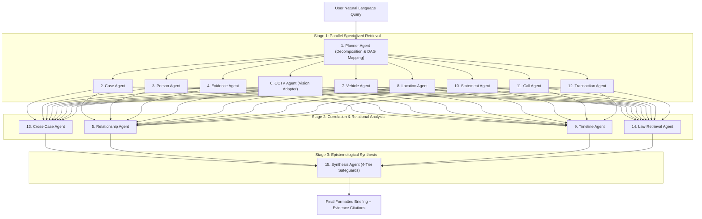

# CrimeMind LangGraph Multi-Agent Intelligence Engine

> **The Core Intelligence Layer of CrimeMind**  
> Dynamic, multi-LLM orchestration architecture coordinating 15 specialized investigative agents across concurrent retrieval, multi-hop relationship mapping, cross-case analysis, timeline synchronization, and 4-tier epistemological synthesis.

---

## 1. System Architecture



---

## 2. Directory Layout

```
agents/
├── app/
│   ├── main.py                       # CLI execution & backend export interfaces
│   ├── config/
│   │   ├── __init__.py
│   │   └── settings.py               # Multi-LLM provider & execution settings
│   ├── graph/
│   │   ├── __init__.py
│   │   ├── state.py                  # Shared typed InvestigativeState & Pydantic models
│   │   ├── routing.py                # DAG stage routing & parallel task dispatchers
│   │   └── master_graph.py           # MasterInvestigativeGraph & backend functions
│   ├── agents/
│   │   ├── __init__.py
│   │   ├── planner_agent.py          # Query decomposition & task creation
│   │   ├── case_agent.py             # Case dossiers, status & crime category
│   │   ├── evidence_agent.py         # Forensic evidence & SHA-256 custody audit
│   │   ├── person_agent.py           # Suspect identities, aliases & associates
│   │   ├── relationship_agent.py     # Graph nodes & edges (multi-hop traversal)
│   │   ├── cctv_agent.py             # Optical detections, plate OCR & vision adapter
│   │   ├── vehicle_agent.py          # Vehicle registrations, VIN & stolen records
│   │   ├── location_agent.py         # Spatial coordinates & transit feasibility
│   │   ├── timeline_agent.py         # Multi-modal chronological synchronization
│   │   ├── statement_agent.py        # Witness depositions & contradiction analysis
│   │   ├── call_agent.py             # Call detail records & recurring contact clusters
│   │   ├── transaction_agent.py      # Suspicious wire transfers & financial chains
│   │   ├── cross_case_agent.py       # Cross-dossier overlap & pattern matching
│   │   ├── law_retrieval_agent.py    # Fourth Amendment & statutory compliance
│   │   └── synthesis_agent.py        # 4-tier epistemological investigative briefing
│   ├── tools/
│   │   ├── __init__.py
│   │   ├── database_tools.py         # Typed, parameterized PostgreSQL repositories
│   │   ├── evidence_tools.py         # Cryptographic custody verification
│   │   ├── graph_tools.py            # Subgraph construction (nodes & edges)
│   │   ├── cctv_tools.py             # Camera feeds & pluggable VisionModelAdapter
│   │   ├── location_tools.py         # Proximity & transit feasibility analysis
│   │   ├── search_tools.py           # Unified cross-dossier keyword search
│   │   └── timeline_tools.py         # Chronological multi-source aggregator
│   ├── models/
│   │   ├── __init__.py
│   │   └── llm_factory.py            # Multi-provider client abstraction
│   ├── memory/
│   │   ├── __init__.py
│   │   └── conversation_store.py     # Multi-turn dialogue & entity accumulator
│   ├── prompts/
│   │   ├── __init__.py
│   │   └── investigative_prompts.py  # System prompts enforcing ethical guardrails
│   └── utils/
│       ├── __init__.py
│       ├── geo_utils.py              # Haversine distance & speed calculations
│       ├── logger.py                 # Structured execution timer & status logger
│       └── security_audit.py         # Audit persistence to agent_runs & ai_findings
├── tests/
│   ├── test_planner.py               # Unit tests for query decomposition
│   ├── test_tools.py                 # Unit tests for typed database & forensic tools
│   ├── test_agents.py                # Unit tests for all 15 specialized agents
│   ├── test_master_graph.py          # Integration tests for execution & streaming
│   └── test_epistemology_safeguards.py# Tests for 4-tier safeguards & disclaimers
├── .env.example                      # Multi-LLM provider & connection template
├── requirements.txt                  # Engine dependencies
└── README.md                         # This documentation
```

---

## 3. The 15 Specialized Agents

| # | Agent Name | Primary Responsibility | Key Output / Schema |
|---|---|---|---|
| 1 | **Planner Agent** | Decomposes user inquiries into a structured DAG of agent tasks | `tasks: List[TaskItem]`, `plan: List[str]` |
| 2 | **Case Agent** | Queries active/historical dossiers, priority, status, and incidents | `cases: List[Dict]` |
| 3 | **Person Agent** | Resolves synthetic identities, aliases, risk levels, and known ties | `persons: List[Dict]` |
| 4 | **Evidence Agent** | Audits cryptographic file hashes (SHA-256) and chain-of-custody logs | `evidence: List[Dict]` |
| 5 | **Relationship Agent** | Maps multi-hop entity topologies (Person $\rightarrow$ Vehicle $\rightarrow$ CCTV $\rightarrow$ Case) | `nodes: List[GraphNode]`, `edges: List[GraphEdge]` |
| 6 | **CCTV Agent** | Queries optical camera feeds, bounding boxes, and license plate OCR | Optical detections & camera metadata |
| 7 | **Vehicle Agent** | Tracks vehicles across optical sensors, case dossiers, and stolen lists | Vehicle profiles & plate cross-references |
| 8 | **Location Agent** | Analyzes spatial coordinates and possible observation sequences | Geographical coordinates & transit intervals |
| 9 | **Timeline Agent** | Unifies telemetry (CCTV, calls, bank wires, depositions) chronologically | `timeline: List[TimelineItem]` |
| 10 | **Statement Agent** | Analyzes formal witness depositions, extracting entities and contradictions | Statement citations & contradiction flags |
| 11 | **Call Agent** | Evaluates Call Detail Records (CDR), frequency clusters, and tower pings | Recurring contact counts & durations |
| 12 | **Transaction Agent**| Identifies suspicious wire transfers, structured amounts, and money trails | Transaction chains & SAR indicators |
| 13 | **Cross-Case Agent** | Discovers non-obvious overlaps (people, plates, MO) across historical cases | Cross-case entity linkages & patterns |
| 14 | **Law Retrieval Agent**| Retrieves Fourth Amendment and statutory compliance authorities | Legal standards (Never hallucinates statutes) |
| 15 | **Synthesis Agent** | Compiles all outputs into a 4-tier investigative briefing | `OBSERVED FACT`, `SOURCE-SUPPORTED`, `INFERENCE` |

---

## 4. Multi-LLM Provider Architecture

CrimeMind features a provider-agnostic abstraction layer (`llm_factory.py`). Different models can be assigned to specialized roles without changing agent application code:

```bash
# In .env:
DEFAULT_LLM_PROVIDER=gemini        # gemini, openai, anthropic, openrouter, local, mock

PLANNER_MODEL=gemini-2.0-flash     # Fast task decomposition
REASONING_MODEL=gemini-2.0-pro-exp # High-depth cross-case & relationship analysis
EXTRACTION_MODEL=gemini-2.0-flash  # Rapid entity & statement extraction
SYNTHESIS_MODEL=gemini-2.0-pro-exp # Comprehensive investigative briefing
VISION_MODEL=gemini-2.0-flash      # CCTV frame & optical analysis
EMBEDDING_MODEL=text-embedding-004 # Vector embeddings
```

### Deterministic Forensic Fallback
If API keys are omitted or external services are unreachable, the engine automatically falls back to `DeterministicForensicLLMClient`, ensuring **100% test reliability, zero crashes, and zero vendor lock-in**.

---

## 5. Epistemological Safeguards & Ethical Rules

CrimeMind operates under strict evidentiary and ethical principles:

1. **Four-Tier Certainty Framework**:
   - `OBSERVED FACT`: Direct sensor telemetry, cryptographic hashes (SHA-256), or official government registry entries.
   - `SOURCE-SUPPORTED CONNECTION`: Documented entity links (e.g. shared vehicle title, co-signers, authorized phone subscribers).
   - `AI INFERENCE`: Algorithmic deductions, transit feasibility calculations, and optical similarity matches.
   - `UNVERIFIED POSSIBILITY`: Hypotheses, uncorroborated informant tips, and secondary investigative leads.

2. **Strict Movement Sequence Disclaimer**:
   - The engine **NEVER** states that a subject definitely followed an inferred route.
   - It always uses non-definitive phrasing: `"possible route"`, `"potential movement"`, `"based on available observations"`.
   - Every transit transition is marked with status: `AI_INFERENCE_REQUIRES_VERIFICATION`.

3. **No Automated Accusation**:
   - The platform assists authorized human investigators.
   - It **NEVER** declares a subject guilty or outputs an accusation as verified fact.
   - All synthesized briefings conclude with: `REQUIRES HUMAN INVESTIGATOR VERIFICATION`.

---

## 6. Programmatic Interfaces for FastAPI Backend

The engine is imported directly by the CrimeMind FastAPI backend (`backend/app/services/langgraph_service.py`):

```python
from engine.graph.master_graph import (
    run_investigation,
    stream_investigation,
    run_agent,
    build_case_graph,
    build_person_graph,
    build_timeline
)

# 1. Full synchronous DAG investigation
state = await run_investigation(
    query="Find connections between Marcus Vance and previous cases.",
    case_id="c1a2b3c4-0001-4000-8000-000000000001"
)
print(state.final_response)

# 2. Real-time Server-Sent Events (SSE) streaming
async for event in stream_investigation("Where was vehicle SYN-7X91 observed?"):
    yield f"data: {json.dumps(event)}\n\n"

# 3. Direct single-agent execution
person_state = await run_agent("person_agent", query="Resolve Marcus Vance")

# 4. Domain graphs and timelines
case_graph = build_case_graph("c1a2b3c4-0001-4000-8000-000000000001")
unified_timeline = build_timeline(case_id="c1a2b3c4-0001-4000-8000-000000000001")
```

---

## 7. Running the CLI & Streaming Demo

To execute an investigative inquiry directly from the command line:

```bash
# Standard investigation run
python -m engine.main --query "Find connections between Marcus Vance, vehicle SYN-7X91, and previous cases."

# Real-time token and progress streaming demo
python -m engine.main --query "Where was vehicle SYN-7X91 sighted near the harbor?" --stream
```
