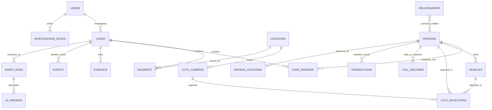

# CrimeMind Domain Data Models & Integration Guide

CrimeMind operates on a normalized PostgreSQL relational foundation augmented with generic property graph traversal, spatio-temporal tracking, unified chronology sequencing, and an isolated AI intelligence layer.

---

## Architecture Principles

1. **Normalized Relational Core**:
   All core entities (`users`, `persons`, `cases`, `incidents`, `vehicles`, `locations`, `cctv_cameras`, `evidence`) have UUID primary keys and strict referential integrity.
2. **Immutable Raw Evidence**:
   Physical and digital evidence records (`evidence`, `statements`, `call_records`, `transactions`, `cctv_detections`) represent raw ingested truth and are strictly immutable.
3. **Strict Separation of AI Findings**:
   LangGraph agents and AI reasoning engines log their executions in `agent_runs` and record intelligence insights in `ai_findings`. AI models **never** modify or overwrite raw evidence.
4. **Sub-Millisecond Graph Traversal**:
   The `relationships` table enables bi-directional graph traversals across any heterogeneous entity pair (Person ↔ Person, Person ↔ Vehicle, Vehicle ↔ CCTV, Person ↔ Case) without requiring an external NoSQL graph database.

---

## Entity-Relationship Schema Map



---

## 20 Core Domain Tables

| # | Table Name | Primary Key | Key Relationships | Core Purpose |
|---|---|---|---|---|
| 1 | `users` | `user_id` (UUID) | Auth & Roles | Investigators, analysts, supervisors, and administrators |
| 2 | `locations` | `location_id` (UUID) | Coordinates & Risk | Geo-referenced spatial spots, commercial sites, districts |
| 3 | `cases` | `case_id` (UUID) | `users`, `locations` | Master investigative dossiers and operational files |
| 4 | `persons` | `person_id` (UUID) | Synthetic Identities | Suspects, victims, witnesses, associates, and profiles |
| 5 | `case_persons` | `case_person_id` (UUID) | `cases`, `persons` | Role mapping (suspect, victim, witness, POI) within cases |
| 6 | `incidents` | `incident_id` (UUID) | `cases`, `locations` | Specific criminal incidents, breaches, and occurrences |
| 7 | `vehicles` | `vehicle_id` (UUID) | `persons` | Synthetic registrations, VINs, makes, models, colors |
| 8 | `cctv_cameras` | `camera_id` (UUID) | `locations` | Sensor surveillance metadata, streams, status |
| 9 | `cctv_detections` | `detection_id` (UUID) | `cctv_cameras`, `persons`, `vehicles` | High-volume time-stamped detections with bounding boxes |
| 10 | `evidence` | `evidence_id` (UUID) | `cases`, `incidents`, `users` | Raw documents, images, video, ballistics, forensics, chain of custody |
| 11 | `statements` | `statement_id` (UUID) | `cases`, `persons`, `users` | Interrogations, depositions, and witness transcripts |
| 12 | `call_records` | `call_id` (UUID) | `persons`, `locations` | Telecom CDR records, cell tower identifiers, durations |
| 13 | `transactions` | `transaction_id` (UUID) | `persons`, `locations` | Synthetic banking, wires, crypto swaps, ATM withdrawals |
| 14 | `person_locations` | `observation_id` (UUID) | `persons`, `locations`, `evidence` | Historical sightings, cell pings, and travel tracking |
| 15 | `relationships` | `relationship_id` (UUID) | Generic Graph Edges | Heterogeneous entity-to-entity edge weights and confidence |
| 16 | `events` | `event_id` (UUID) | `cases`, `locations`, `evidence` | Unified chronological incident and investigative timeline |
| 17 | `agent_runs` | `run_id` (UUID) | `cases` | LangGraph agent execution status, duration, and metrics |
| 18 | `ai_findings` | `finding_id` (UUID) | `cases`, `agent_runs`, `users` | AI-generated hypotheses, patterns, and verification queue |
| 19 | `investigation_notes` | `note_id` (UUID) | `cases`, `users` | Detective logs, field notes, and supervisory directives |
| 20 | `audit_logs` | `log_id` (UUID) | `users` | Regulatory and compliance tracking of who changed what |

---

## LangGraph Agent Query & Integration Patterns

### 1. N-Hop Recursive Graph Traversal (Suspect Association Network)
LangGraph agents querying criminal network connections can execute a recursive common table expression (CTE) directly against `relationships`:

```sql
WITH RECURSIVE suspect_network AS (
    -- Anchor member: Target suspect
    SELECT
        source_entity_id,
        target_entity_id,
        relationship_type,
        confidence,
        1 AS depth,
        ARRAY[source_entity_id] AS path
    FROM relationships
    WHERE source_entity_type = 'PERSON'
      AND source_entity_id = :target_person_id

    UNION ALL

    -- Recursive step: Expand to 2nd and 3rd degree connections
    SELECT
        r.source_entity_id,
        r.target_entity_id,
        r.relationship_type,
        r.confidence * sn.confidence AS confidence,
        sn.depth + 1,
        sn.path || r.source_entity_id
    FROM relationships r
    JOIN suspect_network sn ON r.source_entity_id = sn.target_entity_id
    WHERE sn.depth < 3
      AND NOT (r.target_entity_id = ANY(sn.path))
)
SELECT DISTINCT
    sn.target_entity_id AS connected_person_id,
    p.full_name,
    p.risk_level,
    sn.depth,
    ROUND(sn.confidence, 4) AS compound_confidence
FROM suspect_network sn
JOIN persons p ON sn.target_entity_id = p.person_id
ORDER BY sn.depth ASC, compound_confidence DESC;
```

### 2. Spatio-Temporal Correlation (Suspect Near Crime Scene)
Locating all persons detected on CCTV within 1 kilometer and within ±30 minutes of a reported incident:

```sql
SELECT
    d.detected_at,
    p.person_id,
    p.full_name,
    p.risk_level,
    cam.camera_name,
    loc.address,
    ROUND(
      (6371 * acos(
        cos(radians(inc_loc.latitude)) * cos(radians(loc.latitude)) *
        cos(radians(loc.longitude) - radians(inc_loc.longitude)) +
        sin(radians(inc_loc.latitude)) * sin(radians(loc.latitude))
      ))::numeric, 3
    ) AS distance_km
FROM incidents inc
JOIN locations inc_loc ON inc.location_id = inc_loc.location_id
JOIN cctv_cameras cam ON true
JOIN locations loc ON cam.location_id = loc.location_id
JOIN cctv_detections d ON cam.camera_id = d.camera_id
JOIN persons p ON d.person_id = p.person_id
WHERE inc.incident_id = :target_incident_id
  AND ABS(EXTRACT(EPOCH FROM (d.detected_at - inc.occurred_at))) <= 1800
  AND (6371 * acos(
        cos(radians(inc_loc.latitude)) * cos(radians(loc.latitude)) *
        cos(radians(loc.longitude) - radians(inc_loc.longitude)) +
        sin(radians(inc_loc.latitude)) * sin(radians(loc.latitude))
      )) <= 1.0
ORDER BY distance_km ASC, d.detected_at ASC;
```

### 3. Agent Finding Recording
When a LangGraph agent finishes its reasoning chain, it registers the execution and posts findings without touching raw tables:

```sql
-- Step 1: Record agent run
INSERT INTO agent_runs (
    case_id, agent_name, task, status, started_at, completed_at,
    duration_ms, input_parameters, output_summary, confidence
) VALUES (
    :case_id, 'CrossCaseMatcherAgent', 'Scan for vehicle pattern overlap across active robberies',
    'completed', :started_at, :completed_at, 4200,
    '{"min_confidence": 0.85}'::jsonb,
    '{"matches_found": 1, "target_vehicle": "SYN-7X91"}'::jsonb,
    0.9400
) RETURNING run_id;

-- Step 2: Store AI intelligence finding
INSERT INTO ai_findings (
    case_id, agent_run_id, agent_name, finding_type, title,
    finding_text, confidence, supporting_evidence_ids, supporting_entity_references
) VALUES (
    :case_id, :run_id, 'CrossCaseMatcherAgent', 'cross_case_match',
    'High Confidence Vehicle Correlation: Charger SYN-7X91',
    'Vehicle SYN-7X91 registered to Damian Cross detected on CCTV CAM-04-012 within 18 minutes of commercial robbery.',
    0.9400,
    jsonb_build_array(:evidence_id_1, :evidence_id_2),
    jsonb_build_array(
        jsonb_build_object('type', 'VEHICLE', 'id', :vehicle_id),
        jsonb_build_object('type', 'PERSON', 'id', :person_id)
    )
);
```

---

## FastAPI / REST Backend Endpoint Schema Mappings

| Endpoint | HTTP Method | Backing SQL View / Query | Response DTO |
|---|---|---|---|
| `/api/v1/cases` | GET | `v_case_overview` | `List[CaseSummaryDTO]` |
| `/api/v1/cases/{case_id}/timeline` | GET | `v_case_timeline` | `List[TimelineEventDTO]` |
| `/api/v1/cases/{case_id}/evidence` | GET | `v_evidence_summary` | `EvidenceSummaryDTO` |
| `/api/v1/persons/{person_id}/profile`| GET | `v_person_investigation_profile` | `PersonProfileDTO` |
| `/api/v1/graph/relationships` | GET | `v_person_relationship_graph` | `GraphNetworkDTO` |
| `/api/v1/vehicles/{vehicle_id}/track`| GET | `v_vehicle_movement_history` | `List[VehicleSightingDTO]` |
| `/api/v1/intelligence/cross-case` | GET | `v_cross_case_connections` | `List[CrossCaseMatchDTO]` |
| `/api/v1/intelligence/locations` | GET | `v_location_activity` | `List[LocationThreatDTO]` |
